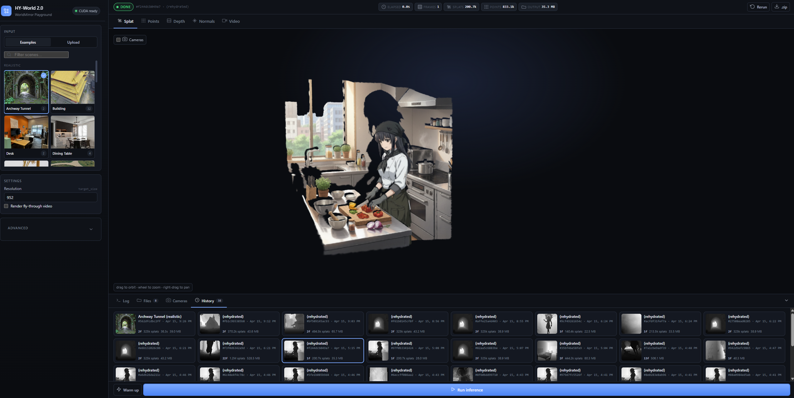

# HY-World 2.0 Playground

A one-click local web UI for running Tencent's **WorldMirror 2.0** — images or a video in, 3D Gaussian Splats, point clouds, depth, normals, and camera poses out. Every modality, every parameter, every past run exposed in a fast Vite + TypeScript frontend over a FastAPI backend. Patched to run on Blackwell GPUs and on Windows without flash-attn.

[](https://github.com/Tencent-Hunyuan/HY-World-2.0)
[](https://www.patreon.com/Machinedelusions)
[](#license)



## Features

- **One-click install + run** — `install.bat` / `install.sh` sets up a venv, pulls CUDA torch, compiles gsplat for your GPU, and runs `npm install`. Then `run.bat` / `run.sh` kills the ports, launches backend + frontend, done.
- **22 bundled example scenes** — realistic rooms, landscapes, stylized characters. Thumbnail grid, click-to-select, live search filter.
- **Drag-and-drop uploads** — drop a folder of images or a single video file; frames get extracted automatically.
- **3D Gaussian Splat viewer** — pre-activated `.splat` binary served over the wire, no sigmoid/SH interpretation for the browser to get wrong.
- **Point cloud, depth, and normal viewers** — click any depth/normal tile to open a side-by-side source-vs-output inspector with arrow-key navigation.
- **Camera frustum overlay** — see where WorldMirror placed the cameras in the 3D scene. Toggle on/off in the splat view.
- **Live job progress** — status pill updates through the pipeline's phases (`Loading input` → `Inferring` → `Writing Gaussian splats` → `Done`).
- **Full job history** — every past run rehydrated from disk on startup with thumbnail, splat count, frame count, elapsed, size. Click to reload instantly.
- **Rerun with one click** — re-fires any completed job with its exact parameters.
- **Every pipeline param exposed** — 28 parameters across Outputs, Masks, Compression, Video input, and Rendered video, organized in collapsible Advanced sections.

## Quick Start

### Windows

```
install.bat
run.bat
```

### Linux / WSL

```
./install.sh
./run.sh
```

Then open **http://localhost:5173**. Pick a scene, hit **Run inference**. Watch it reconstruct!

The model weights (~2.4 GB) download from HuggingFace on the first run and cache to `~/.cache/huggingface/`.

## What's different from upstream

| Change | Why |
| --- | --- |
| torch 2.7+cu128 (not 2.4+cu124) | Blackwell sm_120 support — torch 2.4 kernels cap at sm_90 |
| `TORCH_CUDA_ARCH_LIST=9.0+PTX` at runtime | gsplat compiles for sm_90, driver JITs PTX → sm_120 at first call |
| MSVC-compatible flags in gsplat build | Upstream passes `-Wno-attributes` (GCC) to `cl.exe` |
| flash-attn → PyTorch SDPA fallback | No flash-attn wheel for torch 2.7+cu128 on Windows |
| `tempfile.gettempdir()` for video frames | Upstream hardcoded `/tmp` (doesn't exist on Windows) |
| Filename sanitizer for uploads | Trailing dots in video filenames desync Windows `mkdir` from `open` |
| Pre-activated `.splat` binary endpoint | Upstream's `gaussians.ply` stores sigmoid-activated opacity; any viewer that sigmoids again squashes everything to a translucent haze |
| Server-side PLY Y-flip + quaternion rotation | Upstream world frame is Y-down; viewers expect Y-up |
| NaN/Inf gaussian filter + splat cap | Video-derived scenes occasionally produce bad depths → OOB in the viewer's WASM sort worker |

## Requirements

- **Python 3.10** (the upstream gsplat wheel is `cp310`; the Windows installer requires it via `py -3.10`)
- **Node 18+** for Vite
- **CUDA 12.6+ toolkit** (NVCC) if building gsplat from source on a GPU without a prebuilt wheel. Blackwell works via PTX JIT from CUDA 12.6; native compute_120 requires CUDA 12.8.
- **NVIDIA GPU with ~4 GB VRAM** minimum, more for large scenes. Tested on RTX PRO 6000 Blackwell (97 GB).
- **Visual Studio 2022 Build Tools** on Windows (for the gsplat compile)

## Architecture

```
hyworld2/                       # upstream WorldMirror 2.0 model code
  worldrecon/                   # (+2 modified files — see NOTICE)
app/
  backend/   main.py            # FastAPI: /examples, /infer, /jobs, /gaussians.splat
  frontend/  src/main.ts        # Vite + vanilla TS + @mkkellogg/gaussian-splats-3d
             src/viewer.ts      # Splat + point-cloud viewers, frustum overlay
             src/icons.ts       # 28 inline-SVG icons
scripts/    patch_requirements_windows.py   # swaps linux gsplat wheel → win wheel
            compile_gsplat.bat              # MSVC + CUDA 12.6 build wrapper
install.{bat,sh}                # venv + torch cu128 + gsplat compile + npm i
run.{bat,sh}                    # kill ports, launch backend + frontend
```

## License

- **Model + upstream code** (`hyworld2/`, `examples/`, `assets/` except `radme.png`, `License.txt`, `DOCUMENTATION.md`, etc.): **Tencent HY-WORLD 2.0 Community License Agreement**. See `License.txt` and `NOTICE`. **Not available in the EU, UK, or South Korea.**
- **Playground code** added in this repo (`app/`, `scripts/`, `install.*`, `run.*`, this README, `NOTICE`): **MIT** — see `LICENSE-playground.md`.

Powered by **Tencent HY**. Built by [filliptm](https://github.com/filliptm) / [Machine Delusions](https://www.patreon.com/Machinedelusions).
